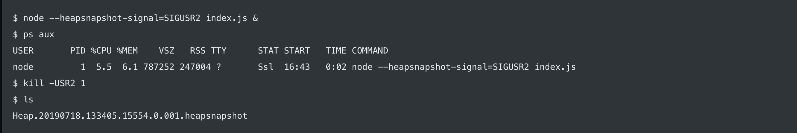
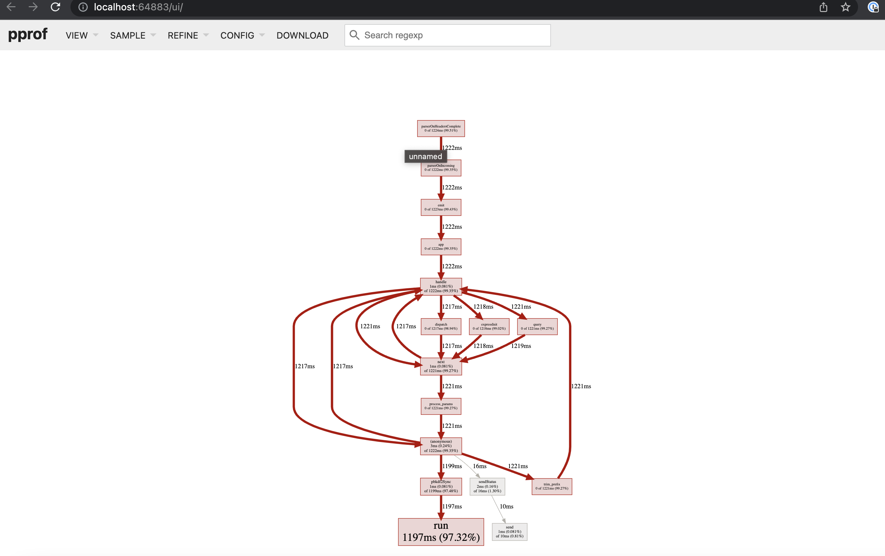
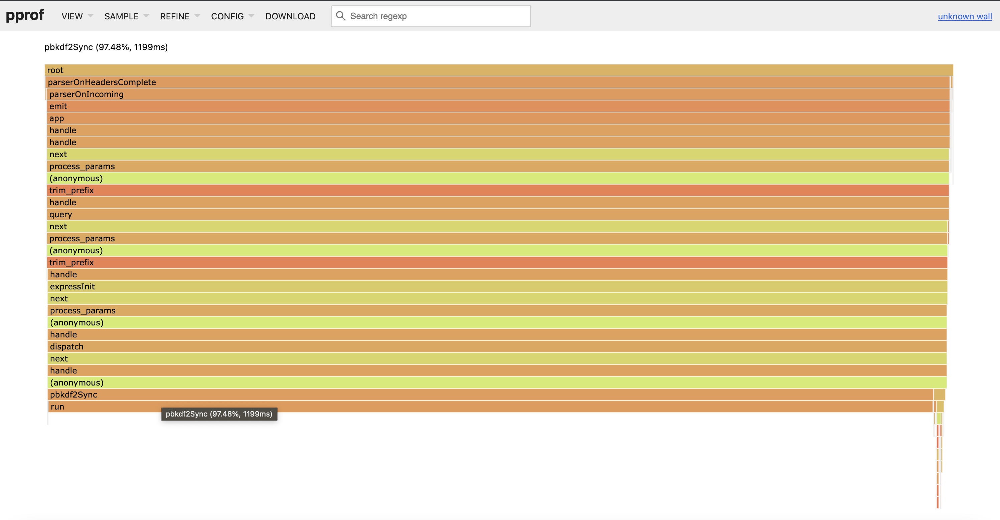

## NodeJS Memory Leak Analysis
"Capturing sampled memory and heap dumps"

- heapdump: https://github.com/bnoordhuis/node-heapdump
- pprof: https://github.com/google/pprof-nodejs
- nodejs native commands
- node-oom-heapdump: https://github.com/blueconic/node-oom-heapdump
- Elastic APM: https://www.elastic.co/guide/en/apm/agent/nodejs/current/metrics.html

---
# Key Learnings
- `heapdump` & `node-oom-heapdump` both require a code change, and are no longer actively maintained, since Node 14 + now supports natively
- `nodejs native commands`
  - `NodeJS 14` onwards `--heapsnapshot-near-heap-limit` is available in node, which can allow max value of 3 e.g. `node --heapsnapshot-near-heap-limit=3 app.js`
  - how it works:, when `GC` fails to execute , it sends a callback, and this flag triggers heapdump
  - `--diagnostic-dir` flag can set the path where the heapdump can be dumped, which could be a mounted volume in k8s

---
    ! we can also trigger heapdump on commands, but this can crash container process !
  
- `pprof-nodejs` a profile sampling library supported by google. This is getting lot of traction in recent days
    
---
    pprof flame graph of nodejs callstack to highlight which function taking longest time

---
# Comparison 

| Tool  | Heap Dump | Profile Sampling | Effort | Selected |
| ---- | ---- | ---- | ---- | ---- |
| heapdump  | :white_check_mark:| :x: | :star: :star:  | No|
| pprof  | :white_check_mark: | :white_check_mark: | :star: | `May Be` |
| node-oom-heapdump | :white_check_mark: | :white_check_mark:| :star: :star: | No |
| node-js v8 commands | :white_check_mark: | :white_check_mark: | :star:| Yes|
| Elastic APM | :x: | :white_check_mark: |  :star: :star: | Yes |

--- 

## Summary
- Enable v8 flags `--heapsnapshot-near-heap-limit=3` `--diagnostic-dir` to mounted volume, via command line `NODE_OPTIONS`, this will provide `heap dump` which we can further diagnose in chrome dev tools
- enable elastic APM module, which will also require code change.
- Preferably test this in `non-prod` environment first
